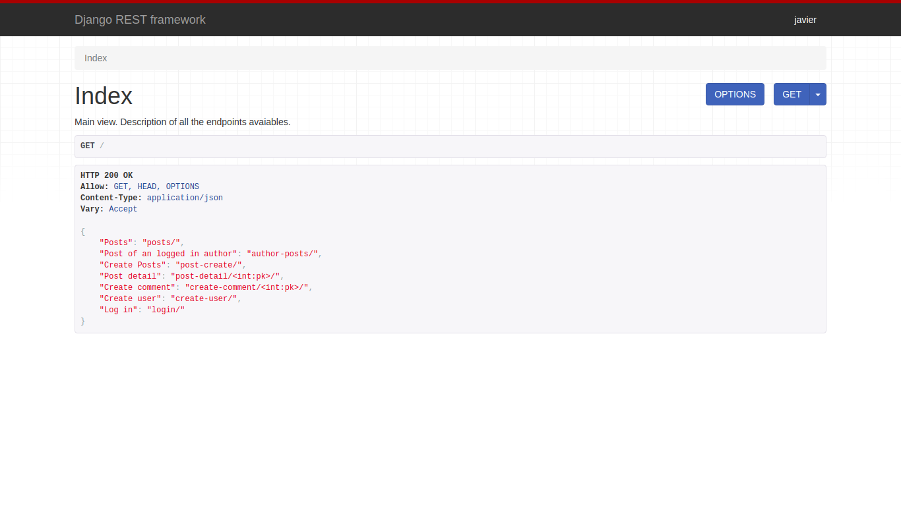

# Posts.  
REST api hecha con Django Rest Framework.  
Lista de todos los posts, lista de post por usuario logeado, retrive, edit y delete de post; creacion de comentarios. Creacion de usuario y login.  
#### Captura de pantalla.
